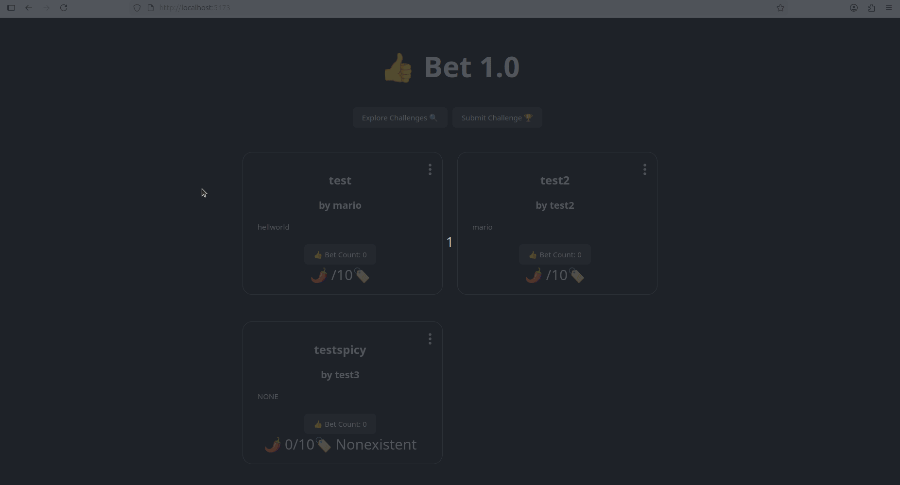

<<<<<<< HEAD
# WEB102- *Lab 7*

Submitted by: **Mario Rodriguez Avila**

***Lab 7** API that accepts information of user commands to find cryto coins and shows prices for current top findings using routes as well this time

Time spent: **2** hours spent in total

**Submission Requirements:**
    - Name: Mario Rodriguez
    - Z: 23689670
    - Git repo: https://github.com/MarioRodrig/web102_unit7lab.git
    
## Gif Walkthrough

<!-- Replace this with whatever GIF tool you used! -->
GIF created with ...  Peek
<!-- Recommended tools:
[Kap](https://getkap.co/) for macOS
[ScreenToGif](https://www.screentogif.com/) for Windows
[peek](https://github.com/phw/peek) for Linux. -->

## Notes

Describe any challenges encountered while building the app.

overall packaging/wrappers used kept adding up, overall understandable.

## License

    Copyright [yyyy] [name of copyright owner]

    Licensed under the Apache License, Version 2.0 (the "License");
    you may not use this file except in compliance with the License.
    You may obtain a copy of the License at

        http://www.apache.org/licenses/LICENSE-2.0

    Unless required by applicable law or agreed to in writing, software
    distributed under the License is distributed on an "AS IS" BASIS,
    WITHOUT WARRANTIES OR CONDITIONS OF ANY KIND, either express or implied.
    See the License for the specific language governing permissions and
    limitations under the License.
=======

>>>>>>> 04290e2e5b3fe384358b73a8fc2d889429606bd1
